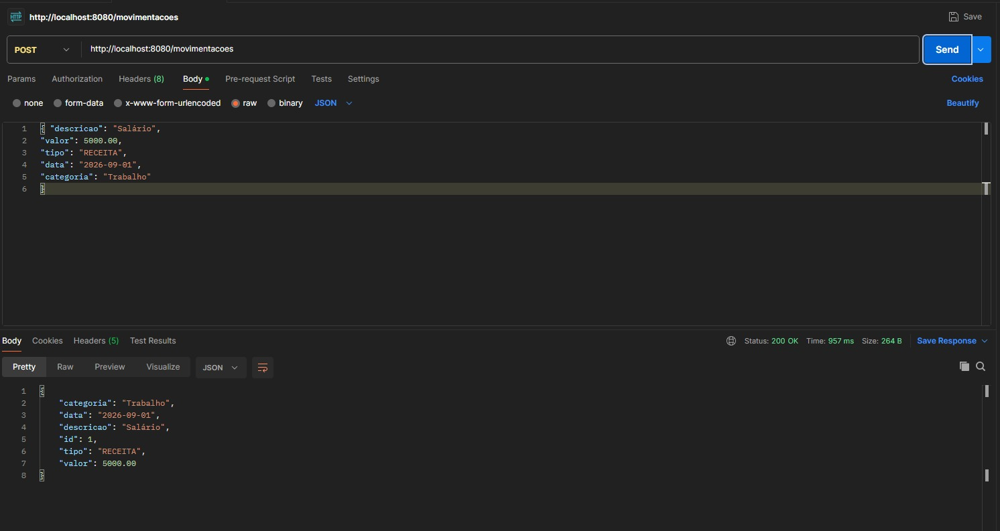
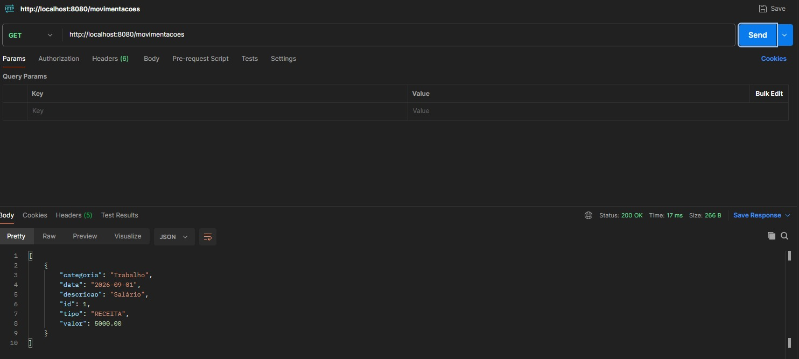
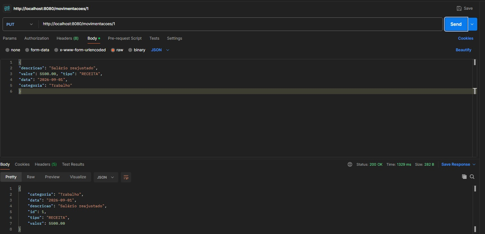
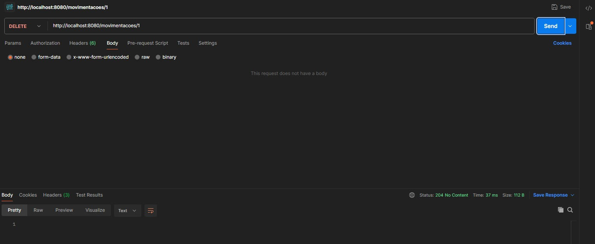
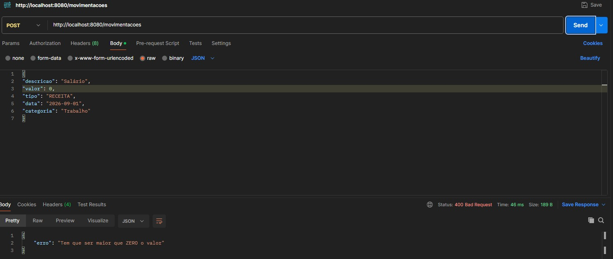
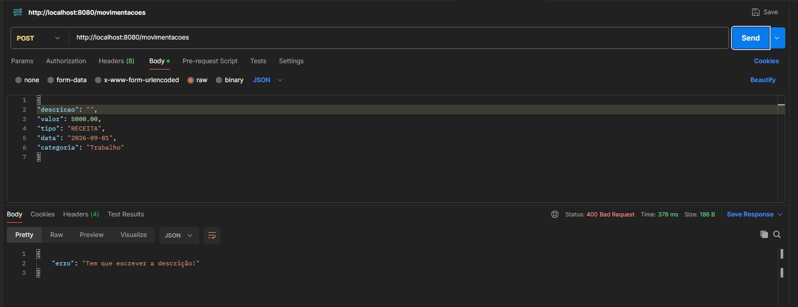
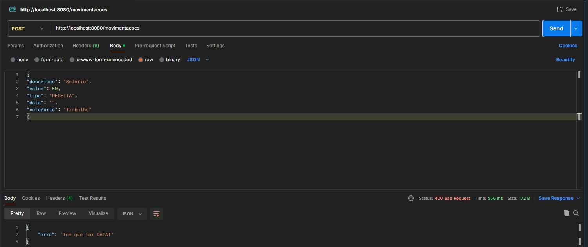
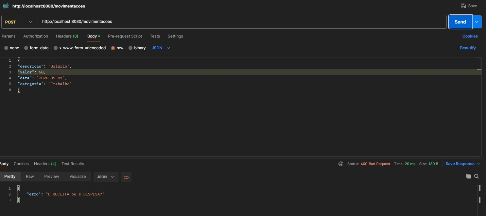
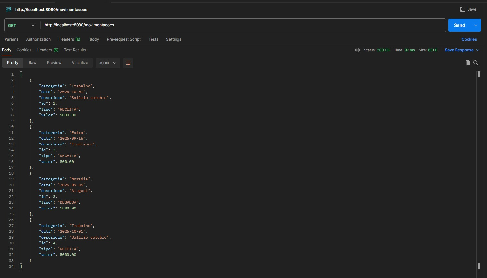
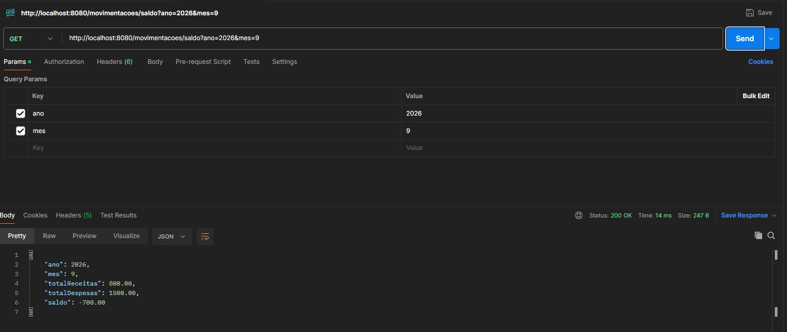

#Nome: Matheus Iury  | RA: 172312657
# Movimentação Financeira com API REST e Spring Boot

## Como usar o sistema
1. Faça o download do repositório e extraia

**No Eclipse:**

1. File > Import > Maven > Existing Maven Projects e selecione a pasta do projeto.
2. Botão direito no projeto, Maven > Update Project.
3. Botão direito em FinancasApplication.java, Run As > Java Application.
4. Quando o console mostrar Started FinancasApplication, a API está no ar em:

http://localhost:8080/movimentacoes

# Testes das funcionalidades no Postman

**1 - Teste de cadastro de movimentação**

**2 - Teste consulta de movimentação**

**3 - Teste alteração de movimentação pelo Id**

**4 - Teste de exclusão de movimentação** 

# Testes das regras de aplicação

**1 - Valor maior que zero**

**2 - Possuir descrição**

**3 - Possuir data**

**4/5 - Possuir tipo/RECEITA ou DESPESA**

**6 - Calculo do saldo mensal**
1. Cadastro da receita mensal

2. Calculo

# FIM 😎

